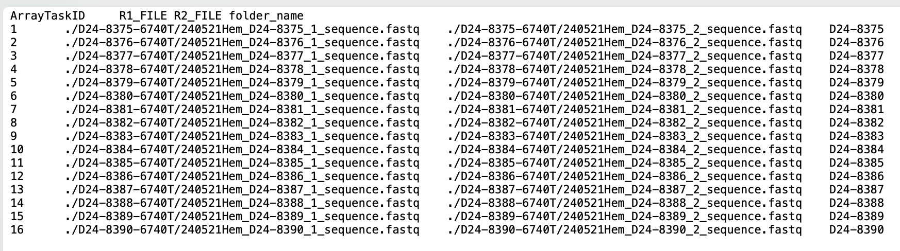

# Base Editing Sensor Analysis Pipeline
Author: Sam Gould | Last Updated: 8/6/24

This repository provides a step-by-step breakdown of going from receiving your sequencing data to getting a processed sensor dataset that includes (1) sequencing quality breakdown, (2) guide counts, (3) sensor editing analysis.

This pipeline is based on the following sequencing strategy, where R1 = Sensor_Read and R2 = Protospacer_READ:


**This pipeline would need to modified to work with alternative sequencing strategies.**

## Downloading your sequencing data
- Log into your Luria cluster account by going into the Terminal and entering your login credentials. This follows the format:

```  
Ssh username@luria.mit.edu
* click enter *
Password
* click enter *
```  
- To download the data to *your server folder*, use the instructions provided in the email from the sequencing core. For example: 


"1. For users with BioMicro Linux cluster (luria.mit.edu) accounts only:
Run rsync in srun or a sbatch script to sync the data to your own data folder (e.g. ~/data/my_target_dir)"
```
srun rsync -av /net/bmc-pub17/data/bmc/public/Sanchez/project_name ~/data/my_target_dir”
```
- You need to replace the folder where the data will be stored, e.g.: 
```
srun rsync -av /net/bmc-pub17/data/bmc/public/Sanchez/project_id /net/bmc-lab2/data/lab/sanchezrivera/your_folder_name
```
*your_folder_name* = the name of your existing folder on the cluster; this step won't work otherwise. For me this is "samgould".


## Step 0: Creating conda environments

In order to run these scripts, you need to create **2** conda environments. Conda environments are essentially sandboxes that allow python scripts to run while referencing all of their required packages/package versions. These environments allow the scripts to run on the cluster, otherwise you would get errors of "package not installed" when trying to import the packages.

The .yml files for creating these conda environments are available in the **conda_environments** folder of this repository. 

To create these conda environments, **copy these .yml files to your own folder on the server**, and then run the following commands after logging into the cluster:

```   
#first start an interactive session outside the head node
srun --pty bash

#cd into your server folder where .yml files are (replace my name)
cd /net/bmc-lab2/data/lab/sanchezrivera/samgould

#load conda
module load miniconda3/v4
source /home/software/conda/miniconda3/bin/condainit

#and then create the two enviornments
#each of these steps may take a while

conda env create -n sensor_lib_sg -f ./sensor_lib_sg.yml
conda env create -n crispresso_env -f ./crispresso_environment.yml


#you can validate these are installed with this command:
conda env list
```  

More info is available about troubleshooting conda environments at the [Luria website](https://igb.mit.edu/mini-courses/advanced-utilization-of-igb-computational-resources/package-management/conda-environments#sharing-conda-environments).


## Step 0.1: Config File & Library File

### Config File:

- The power of the cluster is that we can run jobs for each of the different samples at the same time, which drastically speeds things up. To do so, we must first generate a config file that provides information about the relevant files so that they can be processed by the python scripts.

- Here’s an example of what a config file looks like: 


- The config file consists of 4 column names:
    - (1)  **ArrayTaskID** – numbers starting at #1 to the number of samples
    - (2) **R1_FILE** – read 1 file (relative path within the folder),
    - (3) **R2_FILE**
    - (4) **folder_name** – the name of the folder; can name this anything that keeps track of the samples. I usually just name it in accordance with the read file names and add common names later on.

- This must be saved as a .txt file with sep= ‘ ’, index=False.
e.g.:
``` 
df.to_csv(‘config_file.txt’, sep= ‘ ’, index=False)
``` 

### Library File: 

- You’ll also need to have the library file with the proper column names (this corresponds with the pegg.base columns mostly):

| gRNA_id | Protospacer | Hamming_BC | sensor_wt | sensor_alt |
| --- | ----------- | ---------- | ----------- | ---------- | 

- **gRNA_id**: a unique identifier for each guide RNA
- **Protospacer**: G+19 protospacer, this includes the “G” start.
- **Hamming_BC**: the 15 nt (or whatever length) unique sensor barcode
- **sensor_wt**: wildtype 42 nt sensor sequence
- **sensor_alt**: correctly edited 42 nt sensor 

<span style="color:red">Add (1) the config file and (2) the library file (with proper column names) to the folder that contains your sequencing results on the server (e.g. samgould/San401265).</span>

<span style="color:red">- **The final step is to YOU NEED TO MAKE 4 FOLDERS WITHIN THE SEQUENCING FOLDER. THE NAMES MUST BE EXACT (no capital letters):**</span>

1. classification
2. confusion_mats
3. counts
4. crispresso

## Step 1: Read counts & sensor extraction

- This pipeline works by (A) filtering out low quality reads, (B) counting guides, and (C) splitting sensor reads into separate fastq files for each guide in each sample, and (D) analyzing the sensor editing outcomes. Step #1 takes care of (A)-(C).

- Each python script has a corresponding .sh script that provides instructions to the cluster about which samples to run analysis on/where these files are located. The only thing you will need to edit are these .sh scripts, of which there are 3 (one for each step).

- The first .sh script is **sensor_extraction_guide_counts.sh**:


You need to edit:

1. This needs to match up with the number of samples you’re running. E.g if you’re config file runs from 1-10, set this to 1-10.
2. Change it to your email
3. Change this to the path to your conda env location (using the sensor_lib_sg environment)
4. cd: Set this to match up with the directory where your sequencing data is stored.
/net/bmc-lab2/data/lab/sanchezrivera/your_folder_name
5. config: set this to match up with your config file name with the prefix “./”
6. These are parameters for the run.

    - **splitby** = whether to spli sensors into separate fastq files by the protosapcer identity or the barcode identity (options = 'protospacer' or 'barcode'). I would reccomend keeping this as is.
    - **proto_mismatches_allowed** = # of protospacer mismatches allowed when performing counts
    - **bc_len** = length of barcode (normally 15 nt)
    - **splitby** = length of sensor (normally 42 nt); NOTE: if your sensor is a different length, the downstream steps likely need to be modified slightly


7. Change the library file in the last line: this needs to match up with the name that you’ve given to the file.

Once this is done, add this (1) **sensor_extraction_guide_counts.sh** to your sequencing folder, along with (2) **sensor_extraction_guide_counts.py**

Finally, run the cluster command to execute this .sh script by logging into the cluster and running the command. For example: 

```
sbatch /net/bmc-lab2/data/lab/sanchezrivera/samgould/240624San/sensor_extraction_guide_counts.sh
``` 

<span style="color:red">You will need to change the part after /sanchezrivera/ to match up with your file path.</span>

## Step 2: Sensor analysis


## Step 3: Sensor analysis aggregation


## Post-processing

## Addendum: MAGeCK
