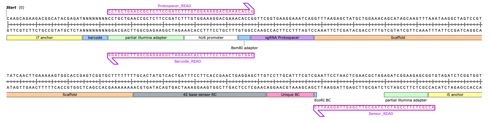
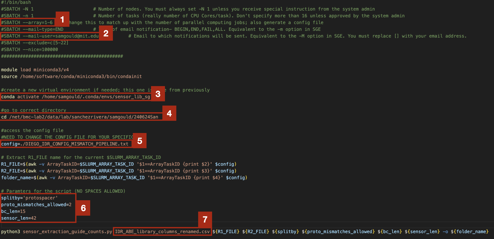
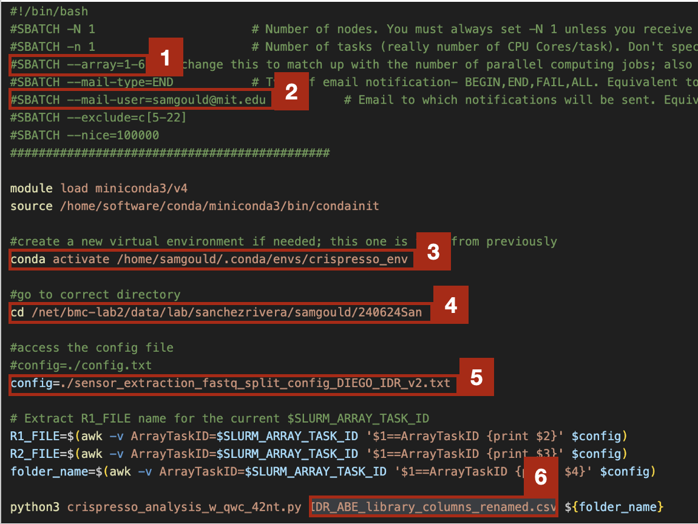
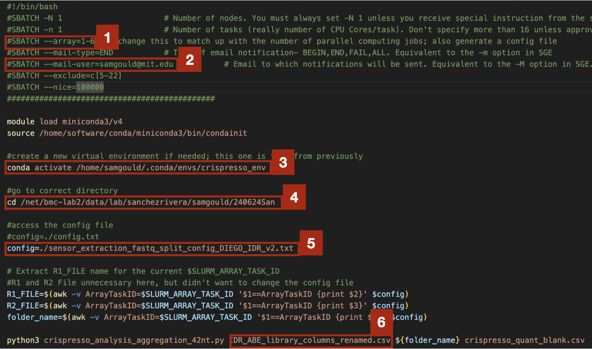

# Base Editing Sensor Analysis Pipeline

This repository provides a step-by-step breakdown of going from receiving your sequencing data to getting a processed sensor dataset that includes (1) sequencing quality breakdown, (2) guide counts, (3) sensor editing analysis.

This pipeline is based on the following sequencing strategy:

**This pipeline would need to modified to work with alternative sequencing strategies.**

| Syntax | Description |
| --- | ----------- |

